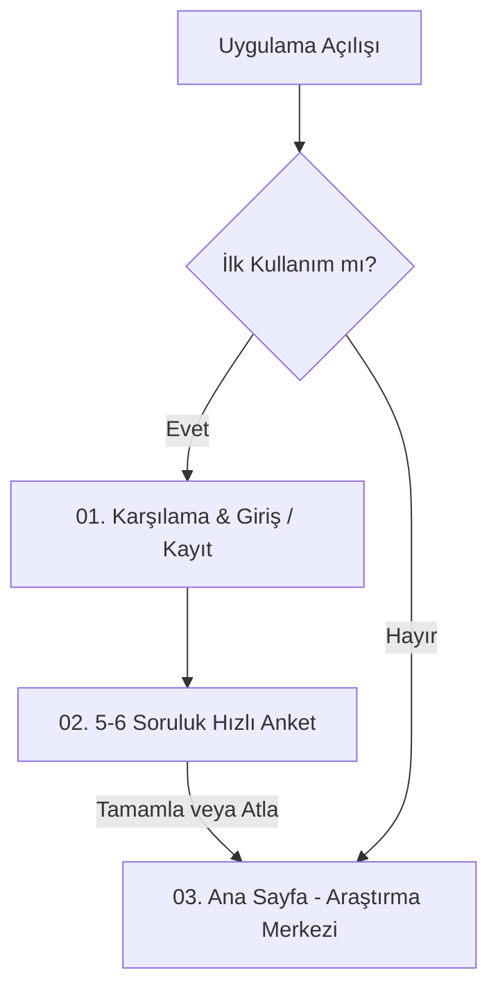
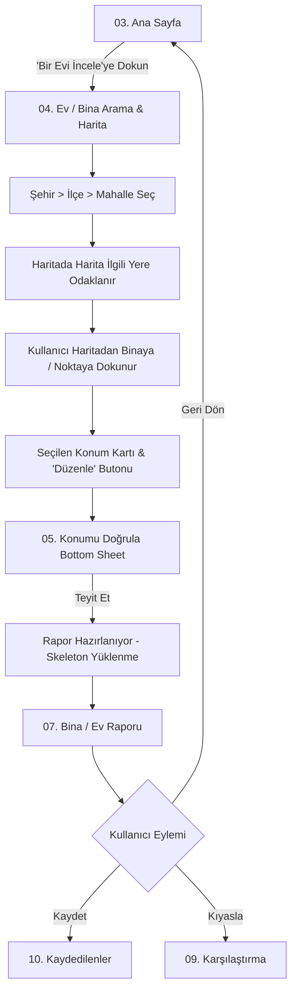
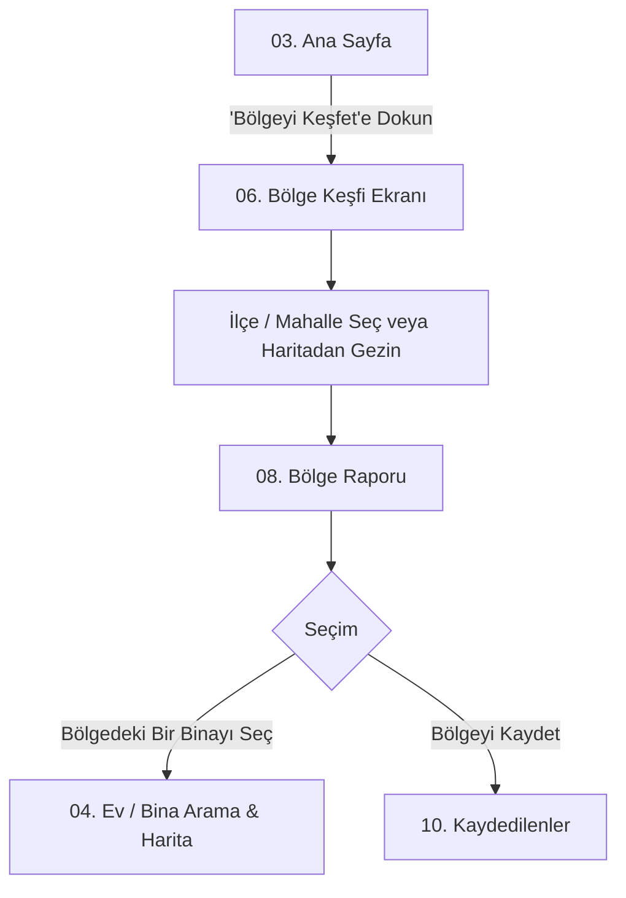
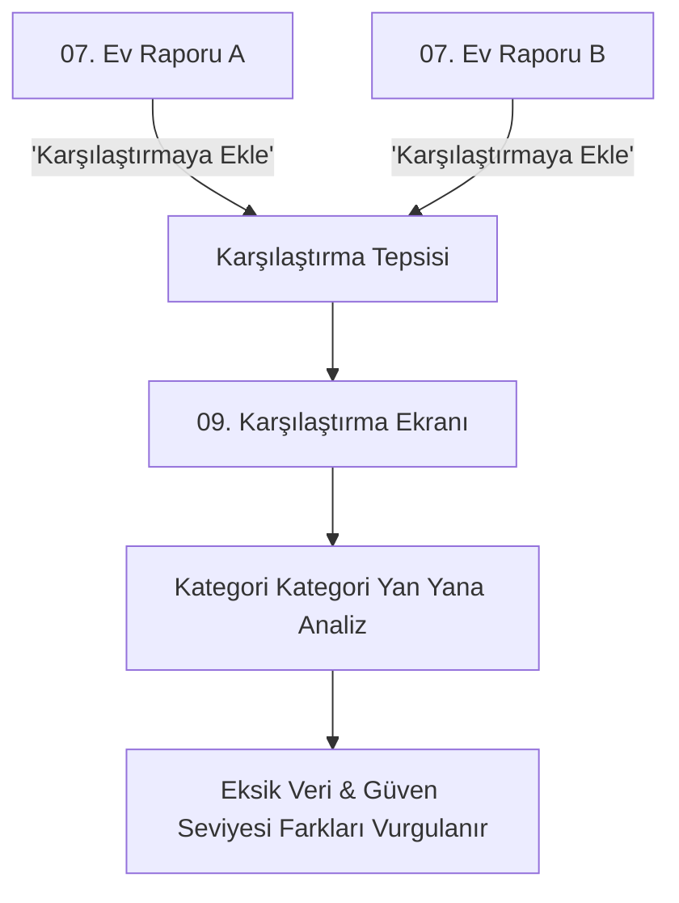
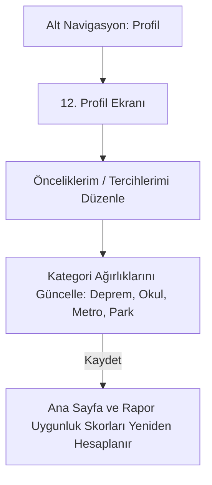

# Frontend: 14 Ekran Mimarisi ve Kullanıcı Akış Şeması (Issue #2)

Bu doküman, Ev Karnesi mobil deneyiminin 14 çekirdek ekranını, navigasyon modelini, ekranlar arası geçişleri (User Flows) ve ekran durumlarını (Dolu, Boş, Yükleniyor, Hata) tanımlar.

---

## 1. Çekirdek Ekran Envanteri ve Navigasyon Matrisi

| # | Ekran Adı | Rota / Ekran Kodu | Navigasyon Türü | Alt Navigasyon Durumu | Ana Görev / Amaç |
|---|---|---|---|---|---|
| **01** | Karşılama, Giriş & Kayıt | `/welcome`, `/auth` | Modal / Bağımsız | Gizli | Kullanıcıyı karşılamak ve hızlı hesap oluşturma / misafir girişi sunmak. |
| **02** | Hızlı Kişiselleştirme Anketi | `/onboarding/survey` | Adımlı Modal | Gizli | 5–6 soruda temel öncelikleri (çocuk, ulaşım, afet duyarlılığı) almak. |
| **03** | Ana Sayfa (Araştırma Merkezi) | `/home` | Kök Ekran | **Görünür (Sol Aktif)** | Son araştırmaları göstermek ve ev/bölge arama modlarına giriş sağlamak. |
| **04** | Ev / Bina Arama & Harita Seçimi | `/search/property` | Kök / Çalışma Alanı | **Görünür (Orta Aktif)** | Şehir/ilçe/mahalle seçimi ve haritadan bina/nokta işaretleme. |
| **05** | Konumu Doğrula | `/search/confirm-location` | Bottom Sheet / Modal | Gizli | Seçilen adres/parsel ve bina numarasını kullanıcıya teyit ettirmek. |
| **06** | Bölge Keşfi | `/search/area` | Kök / Çalışma Alanı | **Görünür (Orta Aktif)** | İlçe/mahalle düzeyinde genel harita ve filtreli bölge araştırması. |
| **07** | Bina / Ev Raporu | `/report/property/:id` | Detay Ekranı | Gizli veya Sabit Eylem | 7 kategoride açıklanabilir Ev Karnesi'ni sunmak. |
| **08** | Bölge Raporu | `/report/area/:id` | Detay Ekranı | Gizli veya Sabit Eylem | Mahalle/ilçe bazında zemin, afet, ulaşım ve yaşam özetini sunmak. |
| **09** | Karşılaştırma | `/compare` | Alt Ekran | Görünür | Seçilen en az iki evin karnesini yan yana, ortak ölçekte kıyaslamak. |
| **10** | Kaydedilenler | `/saved` | Profil Alt Ekranı | Görünür | Kullanıcının kaydettiği ev ve bölge raporlarını listelemek. |
| **11** | İnceleme Geçmişi | `/history` | Profil Alt Ekranı | Görünür | Kullanıcının son baktığı raporları zamansal sırayla göstermek. |
| **12** | Profil ve Önceliklerim | `/profile`, `/profile/priorities` | Kök Ekran | **Görünür (Sağ Aktif)** | Hesap yönetimi ve anket tercihlerini/ağırlıklarını yeniden düzenleme. |
| **13** | Ayarlar ve Gizlilik | `/settings` | Alt Ekran | Görünür | Bildirim, dil ve hassas konum/geçmiş silme kontrolleri. |
| **14** | Yardım ve Metodoloji | `/help/methodology` | Bilgilendirme Ekranı | Görünür | Skorların nasıl hesaplandığını, veri sınırlarını ve SSS'yi açıklamak. |

---

## 2. Detaylı Kullanıcı Akış Şemaları (Mermaid)

### Akış 1: İlk Kullanım ve Kişiselleştirme Akışı


---

### Akış 2: Bir Evi İnceleme ve Rapor Üretim Akışı


---

### Akış 3: Bölge Keşfi ve Bölge Raporu Akışı


---

### Akış 4: İki Evi Karşılaştırma Akışı


---

### Akış 5: Tercihleri ve Öncelikleri Güncelleme Akışı


---

## 3. Ekran Durum Modelleri (State Patterns)

Her mobil ekran aşağıdaki 4 temel durumu standart olarak desteklemelidir:

```text
┌───────────────────────────────────────────────────────────────────┐
│                        STANDART EKRAN DURUMLARI                   │
├─────────────────┬─────────────────┬─────────────────┬─────────────┤
│   1. DOLU       │   2. BOŞ        │   3. YÜKLENİYOR │   4. HATA   │
│   (Populated)   │   (Empty State) │   (Loading)     │   (Error)   │
├─────────────────┼─────────────────┼─────────────────┼─────────────┤
│ Normal veri     │ İlk kullanımda  │ Skeleton loader │ Bağlantı    │
│ gösterimi ve    │ net çağrı (CTA) │ ve aşama        │ veya veri   │
│ kart listeleri  │ ve açıklayıcı   │ bildirimleri    │ hatasında   │
│                 │ illüstrasyon    │                 │ tekrar dene │
└─────────────────┴─────────────────┴─────────────────┴─────────────┘
```

1. **Ana Sayfa Boş Durumu:**
   * Kullanıcının henüz geçmişi yoksa gri bir boşluk yerine büyük bir araştırma kartı ve "İlk evini veya bölgeni inceleyerek başla" çağrısı gösterilir.
2. **Harita Hata Durumu:**
   * Harita sunucusu yanıt vermezse, yönetimsel form (Şehir/İlçe/Mahalle) kullanılabilir kalır ve manuel sokak/bina no girişiyle akış sürdürülür.
3. **Rapor Yüklenme Durumu:**
   * "Veriler toplanıyor" metni yerine kategorik süreç adımları gösterilir (*"Zemin haritaları taranıyor...", "Ulaşım hatları taranıyor..."*).

---

## 4. Sonuç

Bu ekran mimarisi ve kullanıcı akışları, **Issue #2** gereksinimlerini eksiksiz karşılamakta olup bir sonraki aşama olan **Issue #3 (Mobil Görsel Dil ve Tasarım Sistemi)** için sağlam bir omurga oluşturmaktadır.
